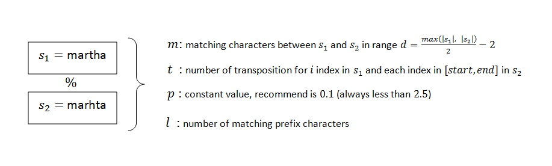
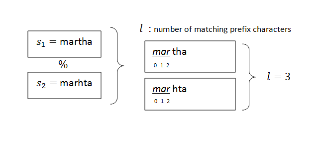
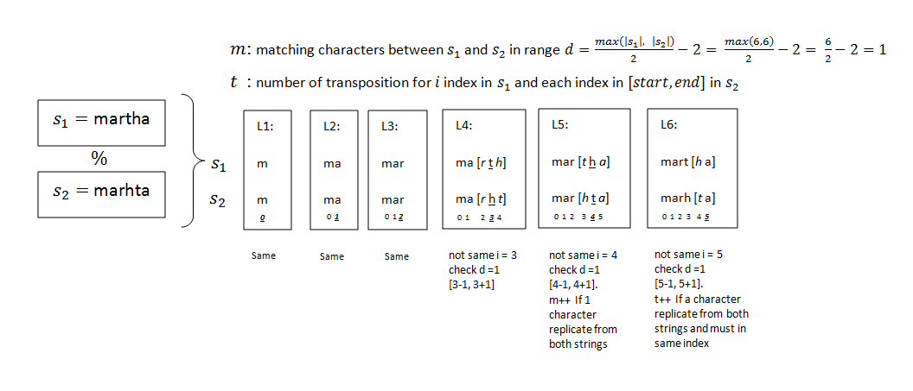
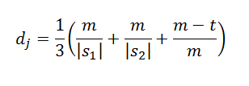
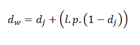

# Jaro-Winkler 
In order to optimize searching result, Jaro-Winkler algorithm is provide the outstanding way to retrieve more meaning data for search request

## Introduction
The algorithm estimates the similarity percentage between 2 input strings s1 and s2. 

## Calculation
Get matching prefix:

Estimate m and t elements to describe the matching transposition between both input strings.

## Math formula
Jaro original formula

Jaro-Winkler optimal formula

## Dicussion
* Can be applied into search engine and calculate the percentage for input search box text and field value in every record
* Improving the Runtime of Bounded Jaro-Winkle based on length-based filter [paper](read_pic/om2014_Tpaper4.pdf)
